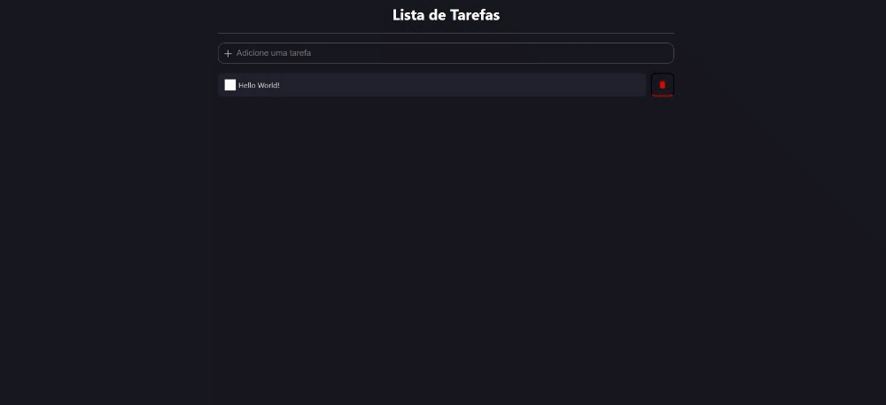
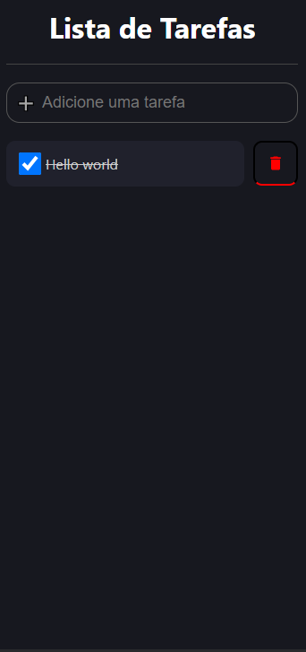

<h1 align="center">
  💻 Projeto
</h1>
<h4 align="center">
  Projeto criado para praticar e elevar conhecimentos e padrões de Desenvolvimento Front-end.
</h4>

## 🔎Preview

    

         
    <b>Link do Site:</b> <a target="_blank" href='https://snazzy-capybara-a75d09.netlify.app/'>Todo List</a>
    

<h5>Desktop</h5>

<h5>Mobile</h5>

---

## 💼 Tecnologias utilizadas

Para o desenvolvimento deste site utilizei as seguintes tecnologias:

- HTML;
- Fetch API;
- Styled-components;
- TypeScript;
- React.js
  - useState
  - useEffect
  - useAxios (Custom Hooks) 
- Back-end com json-server e express (https://github.com/Isaac-MCastanho/restApiFake-todoList)

---

## 📋 Descrição

    Projeto feito na participação do curso, do <a href="https://www.youtube.com/channel/UCw9mYSlqKRXI6l4vH-tAYpQ">Bonieky Lacerda</a>. 
Vídeo:<a href="https://www.youtube.com/watch?v=95sAtAareR8">Lista de Tarefas em React (com Typescript) - Projeto 1</a>
     

  

A ideia do site era apenas treinar a criação de layouts com react.js e styled-components, de forma estática, mas descidi fazer algo um pouco mais complexo, e transformei o projeto em um CRUD bem básico.

Básicamente oque o projeto faz, é listar as tarefas, que estão na api com a opção de marcar como feita e isso atualiza a api tbm, deletar e criar tarefas novas.

    API hospedada no Heroku, e o site no Netlify.

#### 🔬Refatoração

​	Não refatorado, o projeto ainda está uma bagunça, mas calma uma coisa de cada vez...😅

---

## ▶Execução

Comandos necessários:

**npm start:** Sobe o front-end na porta 3000;
